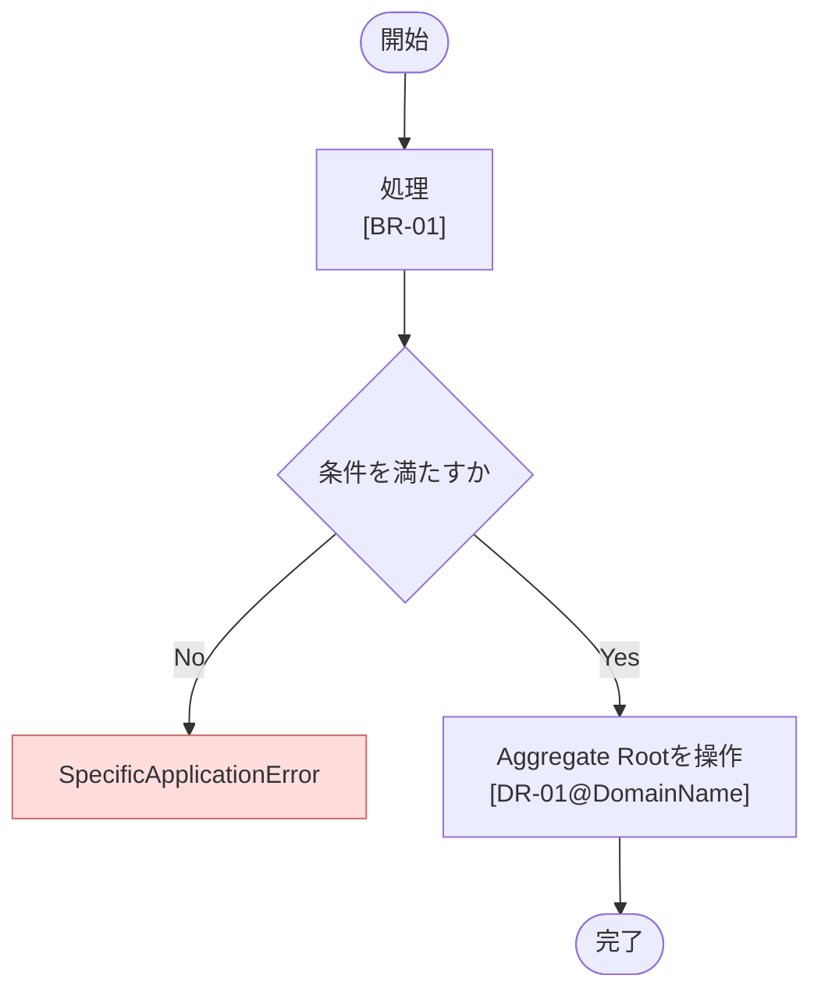

# [ユースケース名] ユースケース仕様書

<!--
作成時の注意:
- Protocol名はクリーンアーキテクチャ上のポート契約として扱う。
- エラー名はユースケース、ドメイン、ポートが外部へ示す失敗理由の契約として扱う。
- 特定のプログラミング言語、DB、SDK、フレームワークの実装詳細は記載しない。
- 仕様を実現するための実装上の工夫は、仕様書ではなく該当コードのコメントへ記載する。
-->

## 1. 概要

- ドメイン: `[domain名]`
- 分類: `[Command / Query]`
- 目的: [このユースケースが達成する業務目的]
- アクター: [実行主体]

## 2. 対象範囲

### 対象

- [このユースケースに含む振る舞い]

### 対象外

- [このユースケースに含まない振る舞い]

## 3. 前提条件・事後条件

### 前提条件

- [ユースケース実行前に満たされている必要がある条件]

### 正常終了時の事後条件

- [正常終了後に保証される業務上の状態]

### 異常終了時の事後条件

- [異常終了時に保証される状態。副作用やロールバックの扱い]

## 4. 入力

- 入力型: `[ユースケース名]Input`
- 引数名: `[query / command]`

Application層の入力を記載する。HTTPリクエスト、リクエストBody、ヘッダーなど、Presentation層固有の入力形式は記載しない。

| フィールド名 | 型・形式 | 必須 | 制約・説明 |
| --- | --- | --- | --- |
| [フィールド名] | [型・形式] | [必須/任意] | [制約・説明] |

単一の値を直接受け取り、独自の入力型を作成しない場合は、その理由と値の型を記載する。

## 5. 出力

- 出力型: `[ユースケース名]Output`

Application層の出力を記載する。HTTPレスポンス、HTTPステータスコードなど、Presentation層固有の出力形式は記載しない。

| フィールド名 | 型・形式 | 説明 |
| --- | --- | --- |
| [フィールド名] | [型・形式] | [説明] |

戻り値がない場合、または単一の値を直接返して独自の出力型を作成しない場合は、その理由と戻り値の型を記載する。

## 6. 認可要件

- [認証済みアクターがこのユースケースを実行できる条件]

認可判断が不要な場合は、その理由とともに「該当なし」と記載する。

## 7. トランザクション・整合性

- トランザクション境界: 1ユースケース
- 更新対象Aggregate: [Aggregate名。Queryの場合は該当なし]
- 保証する整合性: [正常終了時に原子的に保証する状態]
- 複数Aggregateを更新する場合: [必要性と整合性維持方法。該当なしの場合は理由]

## 8. 使用するポート

Protocol名、操作名、契約エラー名は、Application層またはDomain層が必要とする能力と失敗理由を表す抽象的な名称とする。特定の外部サービス、製品、SDK、DBなどの実装名を含めない。

| Protocol | 操作 | 用途 | 送出する可能性のあるエラー |
| --- | --- | --- | --- |
| [Protocol名] | [操作] | [このユースケースでの用途] | [契約上のエラー] |

使用しない場合は「該当なし」と記載する。

## 9. 基本フロー

1. [ユースケース内部の処理]
2. [ユースケース内部の処理]
3. [正常終了時の結果]

### フロー図

`flowchart TD`を使用し、処理順序、分岐、代替系、異常系を記載する。

ルールに対応する処理には、以下の参照タグを付与する。

- `[BR-XX]`: このユースケース固有のビジネスルール
- `[DR-XX@ドメイン名]`: ドメイン仕様書で定義されたドメインルール

DomainエラーおよびApplicationエラーは具体的なエラー名を記載し、エラーメッセージは記載しない。

## 10. 代替フロー

### [代替フロー名]

- 発生条件: [条件]
- 振る舞い: [処理]
- 結果: [終了状態・出力・副作用]

該当しない場合は「該当なし」と記載する。

## 11. 異常系

Domainエラー、Applicationエラー、ポート契約上のエラーと、ユースケースとしての振る舞いを記載する。HTTPステータスコード、公開エラーコード、SDK固有エラーなど、依存範囲外の情報は記載しない。

| エラー | 発生条件 | 副作用・ロールバック | 呼び出し元への結果 |
| --- | --- | --- | --- |
| [具体的なDomain/Application/ポート契約上のエラー] | [条件] | [状態] | [エラーを送出、別エラーへ変換など] |

## 12. ビジネスルール

ドメイン仕様書で定義済みのドメインルールは再掲せず、フロー内の`[DR-XX@ドメイン名]`で参照する。

### BR-01: [ルール名]

- 内容: [このユースケース固有の業務上の制約]
- 違反時のエラー: [具体的なApplicationエラー]

ユースケース固有のビジネスルールがない場合は「該当なし」と記載する。

## 13. 副作用

- 永続化: [作成・更新・削除される情報]
- 外部サービス: [呼び出す外部サービスと目的]
- イベント・通知: [発行するイベントや通知]

該当しない項目は、理由とともに「該当なし」と記載する。

## 14. 受け入れ条件

- [検証可能な正常系の完了条件]
- [検証可能な代替系・異常系の完了条件]

## 15. テスト観点

- 正常系: [代表的な同値クラス]
- 境界値: [最小値、最大値、空、直前・直後など]
- 代替系: [代替フローの条件と期待結果]
- 異常系: [入力エラー、Domainエラー、Applicationエラー、外部依存の失敗]
- トランザクション: [正常終了時のコミット、異常終了時のロールバック]

## 16. 関連仕様書

- ドメイン仕様書: [パス。存在しない場合は不足を記載]
- 外部接続仕様書: [パス。該当なしの場合は理由]

## 17. 未確定事項

- [確認が必要な事項。ない場合は「なし」]

## 18. 備考

- [関連チケットURL、既存仕様との競合など。ない場合は「なし」]

Presentation層またはInfrastructure層だけが関知する設計情報は記載しない。
