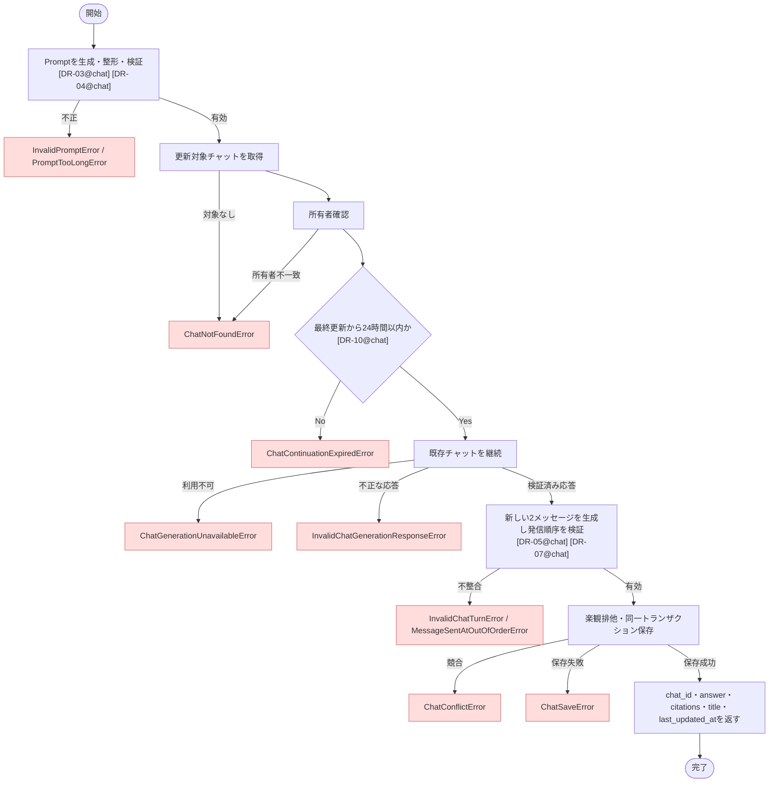

# ContinueChat ユースケース仕様書

## 1. 概要

- ドメイン: `chat`
- 分類: `Command`
- 目的: 認証済みユーザーが所有する既存チャットへプロンプトを追加し、会話を継続する
- アクター: 認証済みユーザー

## 2. 対象範囲

### 対象

- 既存チャットへ追加するプロンプトの整形と検証
- 所有ユーザーに紐づく更新対象チャット本体の取得
- 最終更新日時から24時間未満であることの確認
- チャット生成サービスによる既存チャットの会話継続
- 新しいユーザー・LLMメッセージと更新後のチャット本体の永続化
- チャット生成サービスが返した引用情報の返却

### 対象外

- 新しいチャットの開始
- チャットタイトルの再生成または更新
- チャット履歴の取得
- 回答生成方法および会話継続可能期間の技術的な実現方法

## 3. 前提条件・事後条件

### 前提条件

- ユーザーが認証済みである
- 指定チャットが認証済みユーザーに紐づいている

### 正常終了時の事後条件

- 新しいユーザー質問とLLM回答が同じチャットターンIDで永続化されている
- チャットの最終更新日時が正常なLLM回答日時へ更新されている
- チャットID、AI回答、引用情報、既存タイトル、更新後の最終更新日時が返されている

### 異常終了時の事後条件

- チャット本体およびチャットメッセージは変更されない
- チャット生成サービスの呼び出し成功後に永続化が失敗した場合、外部で生成済みの回答は取り消せない

## 4. 入力

- 入力型: `ContinueChatInput`
- 引数名: `command`

| フィールド名 | 型・形式 | 必須 | 制約・説明 |
| --- | --- | --- | --- |
| `user_id` | UUID | 必須 | 認証済みユーザーを識別する値 |
| `chat_id` | UUID v7 | 必須 | 継続対象チャットの識別子 |
| `prompt` | `str` | 必須 | `Prompt` Value Objectへ変換し、Domainルールに従って整形・検証する |
| `request_id` | UUID v7 | 必須 | Presentationで採番されたリクエスト識別子。新しいユーザー質問とLLM回答の関連付けに使用する |

## 5. 出力

- 出力型: `ContinueChatOutput`

| フィールド名 | 型・形式 | 説明 |
| --- | --- | --- |
| `chat_id` | UUID v7 | 継続したチャットの識別子 |
| `answer` | `str` | チャット生成サービスが返した検証済みのAI回答 |
| `citations` | `GeneratedChatCitation[]` | AI回答に紐づく引用箇所と参照元。チャット生成サービスから引用情報が返らない場合は空配列 |
| `title` | `str` | 継続対象チャットの既存タイトル |
| `last_updated_at` | タイムゾーンを含む日時 | 正常なLLM回答日時へ更新された最終更新日時 |

## 6. 認可要件

- 認証済みユーザーが所有するチャットのみ継続できる
- 指定チャットが存在しない場合と、認証済みユーザーが所有しない場合は区別しない

## 7. トランザクション・整合性

- トランザクション境界: 1ユースケース
- 更新対象Entity・Domainオブジェクト: `Chat`、新しいユーザー・LLM `ChatMessage`
- 保証する整合性: 楽観排他を適用し、`Chat.last_updated_at`・`version`の更新と新しい2メッセージを同一トランザクションで永続化する
- 複数の永続化対象を更新する場合: 更新後の`Chat`本体と同じリクエストIDを持つ2メッセージを同時に保存する

## 8. 使用するポート

| Protocol | 操作 | 用途 | 送出する可能性のあるエラー |
| --- | --- | --- | --- |
| `ChatCommandRepositoryProtocol` | `get_chat` | `chat_id`に対応するチャット本体を取得する | `ChatNotFoundError`, `ChatLoadError` |
| `ChatGenerationClientProtocol` | `continue_chat` | 整形済みプロンプトを使用して既存チャットを継続し、検証済みの回答と引用情報を取得する | `ChatGenerationUnavailableError`, `ChatGenerationRateLimitError`, `ChatGenerationPermissionDeniedError`, `ChatGenerationConfigurationError`, `ChatGenerationSessionUnavailableError`, `InvalidChatGenerationResponseError` |
| `ChatCommandRepositoryProtocol` | `save_exchange` | 更新済みチャット本体と新しいユーザー・LLMメッセージを同一トランザクションで永続化する | `ChatSaveError`, `ChatConflictError` |

## 9. 基本フロー

1. 入力されたプロンプトから`Prompt`を生成し、一般的な前後空白の除去と文字数制約を適用する。
2. `chat_id`に対応する更新対象チャットを取得する。
3. 取得した`Chat.user_id`が認証済みユーザーと一致することを確認する。一致しない場合は存在しない場合と同じ`ChatNotFoundError`として扱う。
4. `Chat`のDomainルールとして、現在日時と`Chat.last_updated_at`の差が24時間以内であることを確認する。[DR-10@chat]
5. ユーザーメッセージの発信日時を記録する。
6. 永続化済みのセッションIDと整形済みプロンプトを渡し、既存チャットを継続する。
7. 検証済み回答と引用情報を受領し、その日時を正常回答日時として記録する。
8. 同じチャットIDとリクエストIDを持つユーザー・LLMメッセージを生成する。
9. 発信順序を検証し、最終更新日時を正常回答日時へ更新して更新バージョンを1増加する。[DR-05@chat] [DR-07@chat] [DR-09@chat]
10. 取得時の更新バージョンから変更されていないことを楽観排他で確認し、更新済みチャット本体と新しい2メッセージを同一トランザクションで保存する。
11. チャットID、AI回答、引用情報、既存タイトル、更新後の最終更新日時を返す。

### フロー図

## 10. 代替フロー

該当なし。

## 11. 異常系

| 例外 | 発生条件 | 副作用・ロールバック | 呼び出し元への結果 |
| --- | --- | --- | --- |
| `ValidationError` | `chat_id`がUUID形式ではない | 外部サービスを呼び出さず、永続化しない | 例外を送出する |
| `InvalidPromptError` | 整形後のプロンプトが空文字 | 外部サービスを呼び出さず、永続化しない | 例外を送出する |
| `PromptTooLongError` | 整形後のプロンプトが1,000文字を超える | 外部サービスを呼び出さず、永続化しない | 例外を送出する |
| `ChatNotFoundError` | 指定チャットが存在しない、または認証済みユーザーが所有しない | 外部サービスを呼び出さず、永続化しない | 例外を送出する |
| `ChatLoadError` | チャット取得元の接続障害やサービス障害により更新対象チャットを取得できない | 外部サービスを呼び出さず、永続化しない | 例外を送出する |
| `ChatContinuationExpiredError` | 最終更新日時から現在日時までが24時間を超過している | 外部サービスを呼び出さず、永続化しない | 例外を送出する |
| `ChatGenerationUnavailableError` | チャット生成サービスから応答を取得できない | 永続化しない | 例外を送出する |
| `ChatGenerationRateLimitError` | チャット生成サービスのレート制限またはクォータ制限により応答を取得できない | 永続化しない | 例外を送出する |
| `ChatGenerationPermissionDeniedError` | チャット生成サービスの呼び出し権限が不足している | 永続化しない | 例外を送出する |
| `ChatGenerationConfigurationError` | チャット生成サービスの設定またはリクエスト構成が不正で応答を取得できない | 永続化しない | 例外を送出する |
| `ChatGenerationSessionUnavailableError` | チャット生成サービス上のセッションが期限切れまたは無効で継続できない | 永続化しない | `ChatContinuationExpiredError`へ変換して送出する |
| `InvalidChatGenerationResponseError` | チャット生成サービスから有効な回答を取得できない | 永続化しない | 例外を送出する |
| `InvalidChatTurnError`, `MessageSentAtOutOfOrderError` | 新しいチャットターンまたは発信順序がDomainルールへ違反する | 永続化しない | 例外を送出する |
| `ChatSaveError` | 更新済みチャット本体または新しい2メッセージの保存に失敗する | ローカル変更をロールバックする | 例外を送出する |
| `ChatConflictError` | 取得後に同じチャットが別処理で更新され、更新バージョンが一致しない | チャット本体と新しい2メッセージを保存しない | 例外を送出する |

## 12. ビジネスルール

### BR-01: 所有チャットのみ継続可能

- 内容: 認証済みユーザーは自身が所有するチャットのみ継続できる。指定チャットが存在しない場合と所有者不一致の場合は区別しない
- 違反時の例外: `ChatNotFoundError`

### BR-02: 会話継続可能期間

- 内容: チャットは`last_updated_at`から現在日時までが24時間以内の場合のみ継続できる。この判定は`Chat`のDomainルールで行う
- 違反時のDomain例外: `ChatContinuationExpiredError`
- ユースケース上の結果: `ChatContinuationExpiredError`を送出する

## 13. 副作用

- 永続化: 正常回答後、更新済みチャット本体と新しいユーザー・LLMメッセージを保存する
- 外部サービス: チャット生成サービスへセッションIDと整形済みプロンプトを渡して会話を継続する
- イベント・通知: 該当なし
- 引用情報: チャット生成サービスから受け取った引用情報を呼び出し元へ返し、LLMメッセージに紐づけて永続化する

## 14. 受け入れ条件

- 最終更新日時から24時間以内の所有チャットを継続できる
- 正常終了時に`answer`とともに`citations`が返される
- 正常回答後に最終更新日時と新しい2メッセージが保存される
- 既存タイトルは変更されず、出力に含まれる
- 24時間を超過したチャットでは外部サービスが呼び出されず、状態も変更されない
- プロンプトには初回チャットと同じ整形・検証が適用される
- 同じ更新バージョンから開始した複数処理では、最初の保存のみ成功し、競合した保存はチャット本体とメッセージを変更しない

## 15. テスト観点

- 正常系: 最終更新直後、24時間経過時点に有効なプロンプトで継続できる
- 境界値: 24時間、24時間1秒、整形後0文字、1,000文字、1,001文字
- 代替系: 該当なし
- 異常系: 対象なし、所有者不一致、継続期限超過、外部サービス利用不可、レート制限、権限不足、設定不備、外部セッション継続不可、不正応答、保存失敗、楽観排他競合
- トランザクション: 正常時のみチャット本体と新しい2メッセージが同時に保存される

## 16. 関連仕様書

- ドメイン仕様書: `docs/backend/specification/domain/chat/domain.md`
- 外部接続仕様書: `docs/backend/specification/infrastructure/dynamodb_chat_repository.md`
- 外部接続仕様書: チャット生成サービスの接続仕様書は未作成

## 17. 未確定事項

- 競合発生時に呼び出し元が自動再試行するか

## 18. 備考

- 24時間の会話継続可能期間は外部依存の制約に由来するが、`Chat`のDomainルールとして扱う
