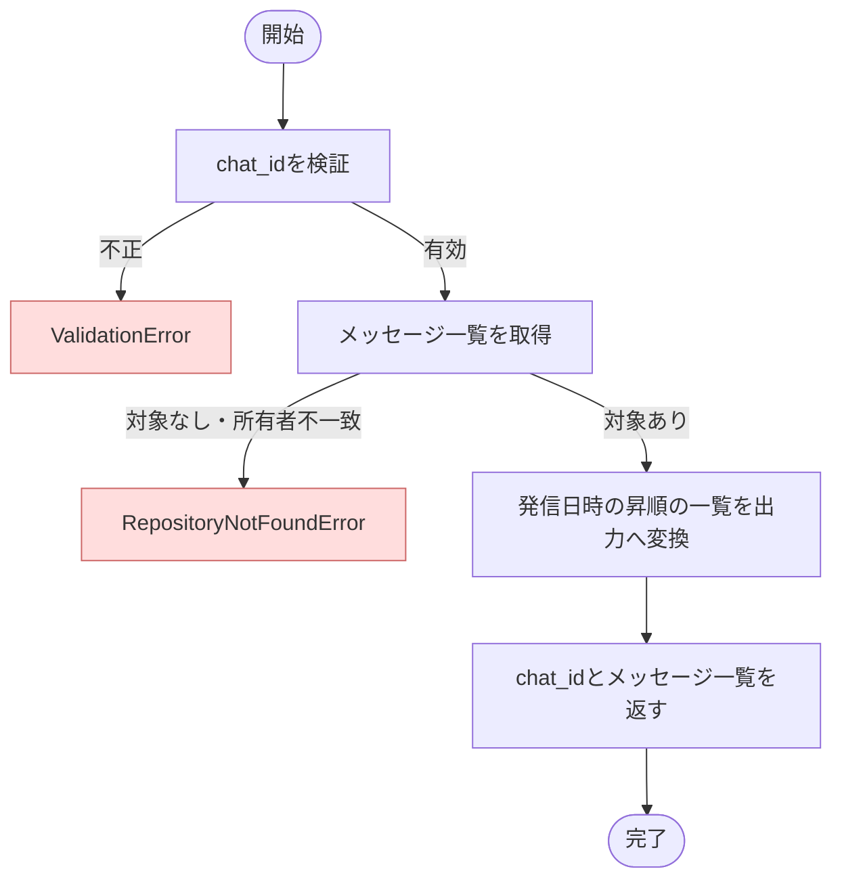

# ListChatMessages ユースケース仕様書

## 1. 概要

- ドメイン: `chat`
- 分類: `Query`
- 目的: 認証済みユーザーが所有する指定チャットの会話履歴を、発信日時順に取得する
- アクター: 認証済みユーザー

## 2. 対象範囲

### 対象

- チャットIDに紐づくチャットメッセージ一覧の取得
- メッセージ発信日時の昇順での並び替え
- 認証済みユーザーが所有するチャットへの取得対象の限定

### 対象外

- チャット本体一覧の取得
- ページネーション、絞り込み条件、並び順の指定

## 3. 前提条件・事後条件

### 前提条件

- ユーザーが認証済みである

### 正常終了時の事後条件

- 指定チャットに紐づくメッセージが発信日時の昇順で返される
- 取得対象は認証済みユーザーが所有するチャットに限定される

### 異常終了時の事後条件

- 業務上の状態は変更されない

## 4. 入力

- 入力型: `ListChatMessagesInput`
- 引数名: `query`

| フィールド名 | 型・形式 | 必須 | 制約・説明 |
| --- | --- | --- | --- |
| `user_id` | UUID | 必須 | 認証済みユーザーを識別する値 |
| `chat_id` | UUID v7 | 必須 | 取得対象チャットの識別子 |
| `request_id` | UUID v7 | 必須 | Presentationで採番されたリクエスト識別子。将来のログ出力で処理を関連付けるために使用する |

## 5. 出力

- 出力型: `ListChatMessagesOutput`

| フィールド名 | 型・形式 | 説明 |
| --- | --- | --- |
| `chat_id` | UUID v7 | 取得対象チャットの識別子 |
| `messages` | `tuple[ChatMessageOutput, ...]` | 発信日時の昇順に並んだチャットメッセージ一覧 |
| `ChatMessageOutput.request_id` | UUID v7 | ユーザー質問とLLM回答を関連付ける識別子 |
| `ChatMessageOutput.sender` | `str` | メッセージ発信者 |
| `ChatMessageOutput.content` | `str` | メッセージ内容 |
| `ChatMessageOutput.sent_at` | タイムゾーンを含む日時 | メッセージ発信日時 |

## 6. 認可要件

- 認証済みユーザーが所有するチャットのメッセージだけを取得する
- 指定チャットが存在しない場合と、認証済みユーザーが所有しない場合は区別しない

## 7. トランザクション・整合性

- トランザクション境界: 1ユースケース
- 更新対象Aggregate: 該当なし。Queryのため状態を変更しない
- 保証する整合性: 指定チャットのメッセージだけが発信日時の昇順で返される
- 複数Aggregateを更新する場合: 該当なし。状態を変更しない

## 8. 使用するポート

| Protocol | 操作 | 用途 | 送出する可能性のあるエラー |
| --- | --- | --- | --- |
| `ChatQueryRepositoryProtocol` | `list_messages_by_chat_id` | 認証済みユーザー所有の指定チャットからメッセージ一覧を発信日時の昇順で取得する | `RepositoryNotFoundError`, `RepositoryAccessError` |

## 9. 基本フロー

1. 入力されたチャットIDがUUID形式であることを検証する。
2. ユーザーIDとチャットIDに紐づくメッセージ一覧を取得する。
3. 発信日時の昇順で取得されたメッセージ一覧を出力へ変換する。
4. チャットIDとメッセージ一覧を返す。

### フロー図

## 10. 代替フロー

該当なし。

## 11. 異常系

| 例外 | 発生条件 | 副作用・ロールバック | 呼び出し元への結果 |
| --- | --- | --- | --- |
| `ValidationError` | `chat_id`がUUID形式ではない | 状態を変更しない | 例外を送出する |
| `RepositoryNotFoundError` | 指定チャットが存在しない、認証済みユーザーが所有しない、またはメッセージが存在しない | 状態を変更しない | 例外を送出する |
| `RepositoryAccessError` | メッセージ取得元の接続障害やサービス障害によりメッセージを取得できない | 状態を変更しない | 例外を送出する |

## 12. ビジネスルール

該当なし。所有ユーザーによる取得対象の限定と並び順は一覧取得の契約で保証する。

## 13. 副作用

- 永続化: 該当なし。状態を変更しない
- 外部サービス: 該当なし
- イベント・通知: 該当なし

## 14. 受け入れ条件

- 指定チャットのメッセージが発信日時の昇順で返される
- ユーザー質問とLLM回答を関連付けるチャットターンIDが返される
- 他ユーザー所有または存在しないチャットでは`RepositoryNotFoundError`が送出される
- 不正なチャットIDはメッセージ取得前に拒否される

## 15. テスト観点

- 正常系: 初回1ターンおよび複数ターンのメッセージが発信日時の昇順で返される
- 同値クラス: 有効なUUID、空文字、不正なUUID形式
- 代替系: 該当なし
- 異常系: 対象チャットなし、他ユーザー所有、メッセージなし、メッセージ取得元の接続障害またはサービス障害
- トランザクション: 状態が変更されない

## 16. 関連仕様書

- ドメイン仕様書: `docs/backend/specification/domain/chat/domain.md`
- 外部接続仕様書: `docs/backend/specification/infrastructure/dynamodb_chat_repository.md`

## 17. 未確定事項

- ページネーションの要否
- 発信日時が同一の場合の第二ソートキー

## 18. 備考

- なし
