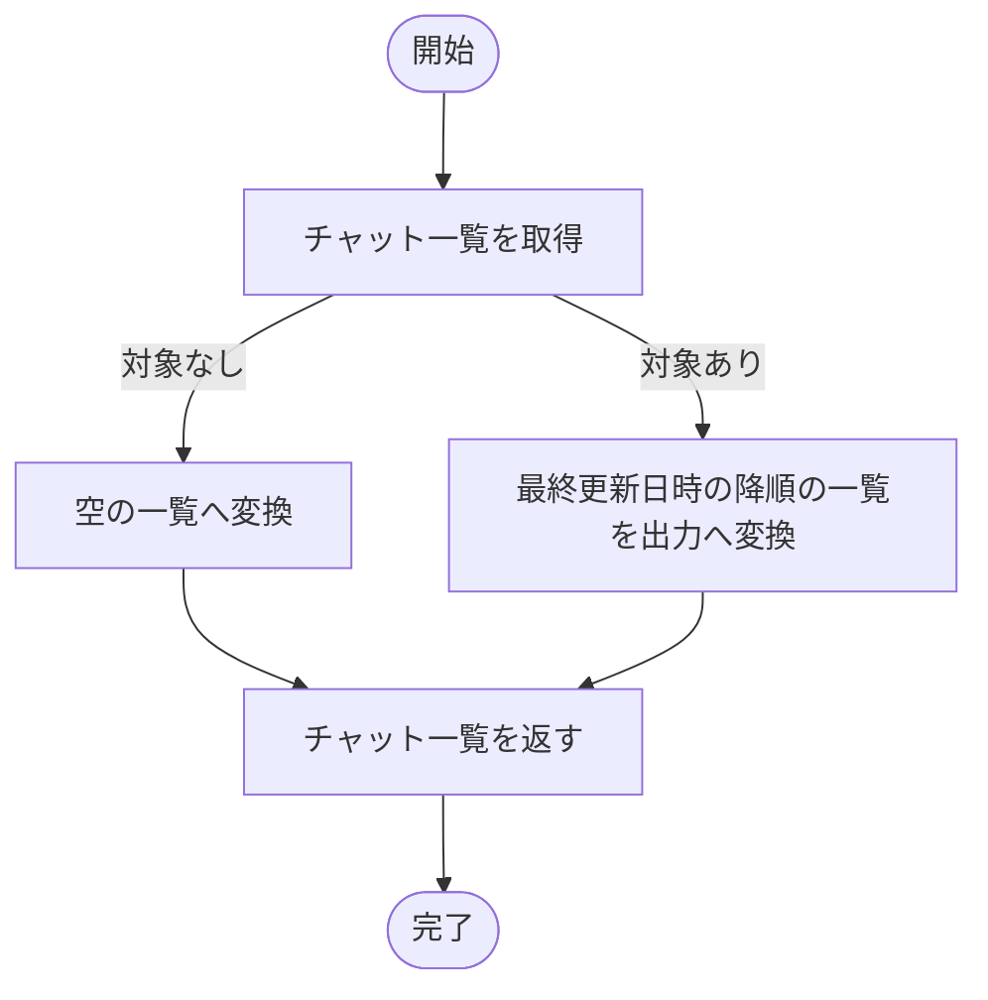

# ListChats ユースケース仕様書

## 1. 概要

- ドメイン: `chat`
- 分類: `Query`
- 目的: 認証済みユーザーが所有するチャットの一覧を、最近更新された順に取得する
- アクター: 認証済みユーザー

## 2. 対象範囲

### 対象

- ユーザーIDに紐づくチャット一覧の取得
- 最終更新日時の降順での並び替え

### 対象外

- チャットメッセージの取得
- ページネーション、絞り込み条件、並び順の指定

## 3. 前提条件・事後条件

### 前提条件

- ユーザーが認証済みである

### 正常終了時の事後条件

- 認証済みユーザーが所有するチャットだけが、最終更新日時の降順で返される
- 対象チャットが存在しない場合は空の一覧が返される

### 異常終了時の事後条件

- 業務上の状態は変更されない

## 4. 入力

- 入力型: `ListChatsInput`
- 引数名: `query`

| フィールド名 | 型・形式 | 必須 | 制約・説明 |
| --- | --- | --- | --- |
| `user_id` | UUID | 必須 | 認証済みユーザーを識別する値 |

## 5. 出力

- 出力型: `ListChatsOutput`

| フィールド名 | 型・形式 | 説明 |
| --- | --- | --- |
| `chats` | `tuple[ChatSummaryOutput, ...]` | 最終更新日時の降順に並んだチャット一覧。対象なしの場合は空 |
| `ChatSummaryOutput.chat_id` | UUID | チャット識別子 |
| `ChatSummaryOutput.title` | `str` | チャットタイトル |
| `ChatSummaryOutput.created_at` | タイムゾーンを含む日時 | チャット作成日時 |
| `ChatSummaryOutput.last_updated_at` | タイムゾーンを含む日時 | チャット最終更新日時 |

## 6. 認可要件

- 認証済みユーザー自身が所有するチャットだけを取得する

## 7. トランザクション・整合性

- トランザクション境界: 1ユースケース
- 更新対象Aggregate: 該当なし。Queryのため状態を変更しない
- 保証する整合性: 取得結果はユーザーIDで限定され、最終更新日時の降順である
- 複数Aggregateを更新する場合: 該当なし。状態を変更しない

## 8. 使用するポート

| Protocol | 操作 | 用途 | 送出する可能性のあるエラー |
| --- | --- | --- | --- |
| `ChatQueryRepositoryProtocol` | `list_chats_by_user_id` | ユーザー所有のチャット一覧を最終更新日時の降順で取得する | `RepositoryNotFoundError`, `RepositoryAccessError` |

## 9. 基本フロー

1. ユーザーIDに紐づくチャット一覧を取得する。
2. 最終更新日時の降順で取得されたチャット一覧を出力へ変換する。
3. チャット一覧を返す。

### フロー図

## 10. 代替フロー

### 対象チャットが存在しない

- 発生条件: 対象チャットが存在しない
- 振る舞い: 空の一覧へ変換する
- 結果: 正常終了し、空の一覧を返す

## 11. 異常系

| 例外 | 発生条件 | 副作用・ロールバック | 呼び出し元への結果 |
| --- | --- | --- | --- |
| `RepositoryAccessError` | チャット一覧の取得元の接続障害やサービス障害により一覧を取得できない | 状態を変更しない | 例外を送出する |

## 12. ビジネスルール

該当なし。ユーザーIDによる取得条件と並び順は一覧取得の契約で保証する。

## 13. 副作用

- 永続化: 該当なし。状態を変更しない
- 外部サービス: 該当なし
- イベント・通知: 該当なし

## 14. 受け入れ条件

- 認証済みユーザーが所有するチャットだけが返される
- 複数件は最終更新日時の降順で返される
- 対象が0件の場合は空の一覧が返される

## 15. テスト観点

- 正常系: 1件および複数件のチャットが最終更新日時の降順で返される
- 境界値: 0件、1件、複数件
- 代替系: 対象なしを空の一覧へ変換する
- 異常系: チャット一覧取得元の接続障害またはサービス障害
- トランザクション: 状態が変更されない

## 16. 関連仕様書

- ドメイン仕様書: `docs/backend/specification/domain/chat/domain.md`
- 外部接続仕様書: `docs/backend/specification/infrastructure/dynamodb_chat_repository.md`

## 17. 未確定事項

- ページネーションの要否
- 最終更新日時が同一の場合の第二ソートキー

## 18. 備考

- なし
