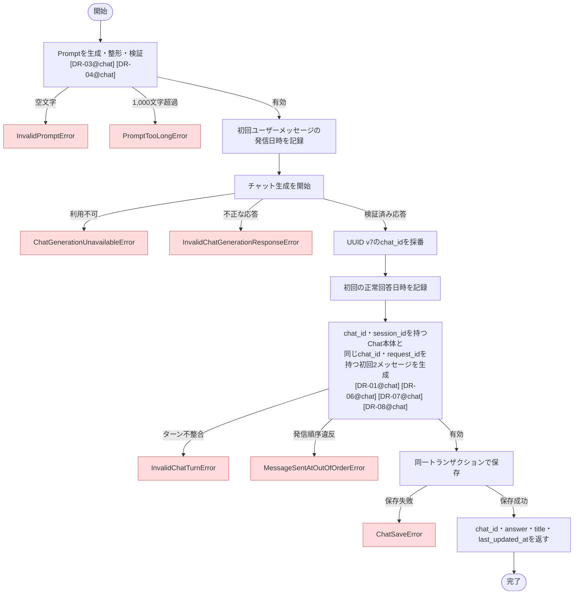

# StartChat ユースケース仕様書

## 1. 概要

- ドメイン: `chat`
- 分類: `Command`
- 目的: 認証済みユーザーが入力した最初のプロンプトをチャット生成サービスへ送信し、開始されたチャットをユーザーに関連付けて保存する
- アクター: 認証済みユーザー

## 2. 対象範囲

### 対象

- 最初のプロンプトを受け付ける
- プロンプトの一般的な前後空白を除去し、ドメインルールに従って検証する
- チャット生成サービスへ整形済みプロンプトを送信する
- チャット生成結果として検証済みのセッションID、AI回答、タイトルを取得する
- アプリケーション内のチャットIDをUUID v7で採番する
- チャット本体と初回のユーザー・LLMメッセージを同一トランザクションで永続化する
- 採番したチャットID、最終更新日時、AI回答、タイトルを返す

### 対象外

- 検索対象論文、検索条件、検索処理、回答生成方法の制御
- 2回目以降のチャット会話
- チャット履歴の取得
- セッションID、AI回答、タイトルの生成方法の制御
- AI回答の根拠、引用箇所、参照論文の返却

## 3. 前提条件・事後条件

### 前提条件

- ユーザーが認証済みである
- チャット生成サービスを呼び出せる状態である

### 正常終了時の事後条件

- チャット生成サービス上で新しいチャットが作成されている
- チャット本体にユーザーID、採番したチャットID、セッションID、タイトル、作成日時、最終更新日時が永続化されている
- 初回のユーザープロンプトとLLM回答がチャットメッセージとして永続化されている
- チャットの作成日時と最終更新日時が、初回の正常なLLM回答日時と一致している
- 初回ユーザーメッセージの発信日時が、初回LLMメッセージの発信日時より後ではない
- 初回のユーザー質問とLLM回答が同じチャットターンIDで関連付けられている
- 採番したチャットID、最終更新日時、AI回答、タイトルが呼び出し元へ返されている

### 異常終了時の事後条件

- チャット本体および初回チャットメッセージの永続化はロールバックされる
- チャット生成サービスの呼び出しおよび作成済みチャットは取り消せない

## 4. 入力

- 入力型: `StartChatInput`
- 引数名: `command`

| フィールド名 | 型・形式 | 必須 | 制約・説明 |
| --- | --- | --- | --- |
| `user_id` | UUID | 必須 | 認証済みユーザーを識別する値 |
| `prompt` | `str` | 必須 | `Prompt` Value Objectへ変換し、Domainルールに従って整形・検証する |
| `request_id` | UUID v7 | 必須 | Presentationで採番されたリクエスト識別子。初回のユーザー質問とLLM回答の関連付けに使用する |

## 5. 出力

- 出力型: `StartChatOutput`

| フィールド名 | 型・形式 | 説明 |
| --- | --- | --- |
| `chat_id` | UUID v7 | 初回登録時にアプリケーションが採番したチャット識別子 |
| `answer` | `str` | 検証済みのAI回答 |
| `title` | `str` | 検証済みのチャットタイトル |
| `last_updated_at` | タイムゾーンを含む日時 | 初回の正常なLLM回答日時 |

## 6. 認可要件

- 認証済みユーザーのみ実行できる
- 正常応答後に、認証済みユーザーのユーザーIDとチャットIDを関連付けて永続化する

## 7. トランザクション・整合性

- トランザクション境界: 1ユースケース
- 更新対象Entity・Domainオブジェクト: `Chat`、初回のユーザー・LLM `ChatMessage`
- 保証する整合性: チャット本体と初回2メッセージを原子的に永続化し、作成日時と最終更新日時を初回の正常なLLM回答日時に一致させる
- 複数の永続化対象を更新する場合: `Chat`本体と初回2メッセージを同一トランザクションで保存する
- チャット生成サービス上でのチャット作成はローカルトランザクションでロールバックできない

## 8. 使用するポート

| Protocol | 操作 | 用途 | 送出する可能性のあるエラー |
| --- | --- | --- | --- |
| `ChatGenerationClientProtocol` | `start_chat` | 整形済みプロンプトからチャットを開始し、検証済みのセッションID、AI回答、タイトルを取得する | `ChatGenerationUnavailableError`, `InvalidChatGenerationResponseError` |
| `ChatCommandRepositoryProtocol` | `save_started_chat` | チャット本体と初回のユーザー・LLMメッセージを同一トランザクションで永続化する | `ChatSaveError` |

## 9. 基本フロー

1. 入力されたプロンプトから`Prompt` Value Objectを生成し、一般的な前後空白の除去と文字数制約を適用する。
2. 初回ユーザーメッセージの発信日時を記録する。
3. 整形済みのプロンプトのみを渡し、チャット生成を開始する。
4. 検証済みのセッションID、AI回答、タイトルを取得する。
5. アプリケーション内のチャットIDをUUID v7で採番する。
6. 検証済み応答を受領した時点の日時を、初回の正常回答日時として記録する。
7. 採番したチャットID、セッションID、初回の正常回答日時を基準として、`created_at`と`last_updated_at`が一致する`Chat`を生成する。
8. 同じ`chat_id`と`request_id`を持つ初回ユーザー・LLMメッセージを生成する。ユーザーメッセージには手順2の日時、LLMメッセージには初回の正常回答日時を設定する。
9. 初回2メッセージがチャットターンと初回発信順序のルールを満たすことを保証する。
10. チャット本体と初回2メッセージを同一トランザクションで永続化する。
11. 採番したチャットID、AI回答、タイトル、最終更新日時を返す。

### フロー図

## 10. 代替フロー

該当なし。チャット生成サービスが回答を生成できない場合の代替回答やフォールバックは行わない。

## 11. 異常系

| 例外 | 発生条件 | 副作用・ロールバック | 呼び出し元への結果 |
| --- | --- | --- | --- |
| `InvalidPromptError` | 一般的な前後空白を除去した後の`prompt`が空文字 | チャット生成サービスを呼び出さず、永続化しない | 例外を送出する |
| `PromptTooLongError` | 一般的な前後空白を除去した後の`prompt`が1,000文字を超える | チャット生成サービスを呼び出さず、永続化しない | 例外を送出する |
| `ChatGenerationUnavailableError` | チャット生成サービスのタイムアウト、接続障害、サービス障害などにより応答を取得できない | 永続化しない。チャット生成サービス側でチャットが作成された可能性は残る | 例外を送出する |
| `InvalidChatGenerationResponseError` | セッションID、AI回答、タイトルを有効な応答として扱えない | 永続化しない。チャット生成サービス側で作成されたチャットは取り消せない | 例外を送出する |
| `InvalidSessionIdError` | チャット生成サービスから取得したセッションIDが空文字または空白文字のみ | 永続化しない | 例外を送出する |
| `InvalidChatTurnError` | 初回のユーザー・LLMメッセージの`chat_id`または`request_id`が一致しない | 永続化しない | 例外を送出する |
| `MessageSentAtOutOfOrderError` | 初回ユーザーメッセージの発信日時が初回LLMメッセージの発信日時より後、またはLLMメッセージ日時とチャットの作成・最終更新日時が一致しない | 永続化しない | 例外を送出する |
| `ChatSaveError` | チャット本体または初回2メッセージの永続化に失敗する | チャット本体と初回2メッセージの変更をすべてロールバックする。チャット生成サービス側で作成されたチャットは取り消せない | 例外を送出する |

## 12. ビジネスルール

該当なし。プロンプト、チャット、メッセージ、チャットターン、日時の制約はドメイン仕様書で定義し、外部応答の妥当性はチャット生成結果の契約で保証する。

## 13. 副作用

- 永続化: チャット生成サービスから正常応答を取得した後、チャット本体と初回のユーザー・LLMメッセージを同一トランザクションで保存する
- 外部サービス: チャット生成サービスへ整形済みの初回プロンプトのみを送信し、チャットを作成する
- イベント・通知: 該当なし。チャット開始時にイベントまたは通知を発行する要求はない

## 14. 受け入れ条件

- プロンプトの一般的な前後空白が除去され、整形済みプロンプトのみがチャット生成サービスへ送信される
- 正常終了時に採番した`chat_id`、初回の正常なLLM回答日時である`last_updated_at`、`answer`、`title`が返される
- 正常終了時にチャット本体と初回のユーザー・LLMメッセージが永続化される
- 初回のユーザー質問とLLM回答が同じチャットターンIDで関連付けられている
- チャット本体の`created_at`と`last_updated_at`が、初回の正常なLLM回答日時と一致する
- TRIM後に空文字または1,000文字を超えるプロンプトは拒否され、チャット生成サービスは呼び出されない
- チャット生成結果が有効なセッションID、AI回答、タイトルを含まない場合は異常終了し、永続化されない
- 初回ユーザーメッセージの発信日時は、初回LLMメッセージの発信日時より後にならない
- 永続化に失敗した場合は異常終了し、ローカルの変更はロールバックされる

## 15. テスト観点

- 正常系: TRIM後に1文字、一般的な長さ、1,000文字となるプロンプトでチャットを開始し、チャット本体と初回2メッセージを保存できる
- 境界値: TRIM後の空文字、1文字、1,000文字、1,001文字、および前後に空白文字を持つプロンプトを検証する
- 代替系: 該当なし
- 異常系: Domainルール違反、チャット生成サービス利用不可、不正なチャット生成応答、初回ターン不整合、発信順序違反、永続化失敗を検証する
- トランザクション: 正常終了時にチャット本体と初回2メッセージがコミットされ、いずれかの永続化失敗時にすべてのローカル変更がロールバックされることを検証する
- LLM・RAG: チャット生成サービス呼び出しはスタブまたはモックへ差し替え、TRIM済みプロンプトのみが送信されることと、応答スキーマを検証する

## 16. 関連仕様書

- ドメイン仕様書: `docs/backend/specification/domain/chat/domain.md`
- 外部接続仕様書: `docs/backend/specification/infrastructure/dynamodb_chat_repository.md`
- 外部接続仕様書: チャット生成サービスの接続仕様書は未作成

## 17. 未確定事項

- チャット生成サービス上でチャット作成後、ローカル永続化に失敗した場合の孤立チャットに対する補償方針
- 同一リクエストの再実行によるチャット生成サービス上のチャット重複作成を防ぐ必要があるか

## 18. 備考

- なし
